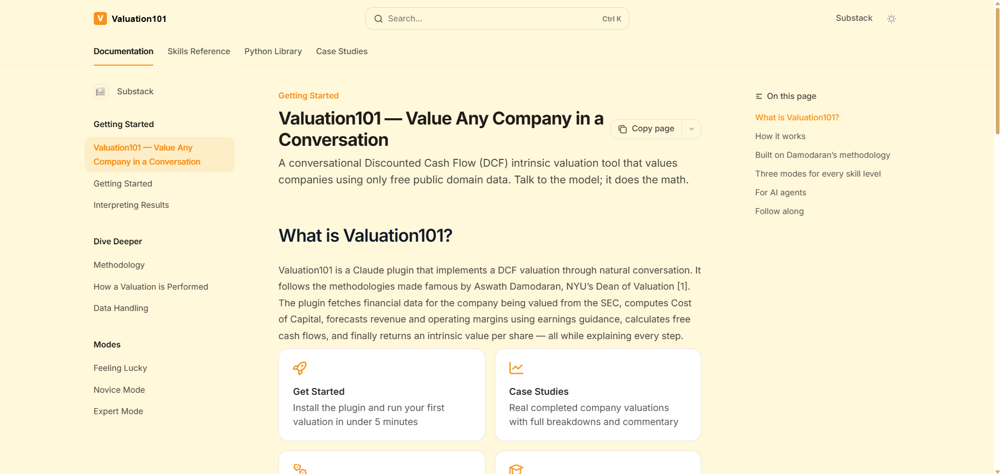

# How to determine the Intrinsic Value of a public company?

## Problem statement
We're in an information rich world, but understanding where to look and what financial data to use still takes skill and know-how. 

Nearly everyone is now a retail investor, but not everyone understands finance, so how do we determine the value of what we're buying?

For most investors, index funds are likely to be the best choice, but for those with a long term view and a higher risk appetite, value investing 

## Solution
Valuation 101 is a Claude plugin that implements an Intrinsic Valuation for public US companies in a simple chat conversation. 
It fetches all the required public financials with high accuracy (revenue, operating margins, debt, etc.).
It then uses a mix of pre-designed rules and judgement to compute the company's value. 
The Plugin also develops bear and bull scenarios to guide the user with a range rather than a single data point. 
By lowering the bar to completing a valuation successfully, the Plugin promotes responsible investing over speculation.

## How
The Valuation 101 plugin is composed of a total of 20 SKILLS. 
It takes care of the entire pipeline, from data fetching, to parsing, the math behind each step of a valuation , putting it all together, preparing an excel model
and case study report.

It demonstrates the capabilities of AI Plugins to resolve complex tasks, repeatably and reliably without hallucination.

