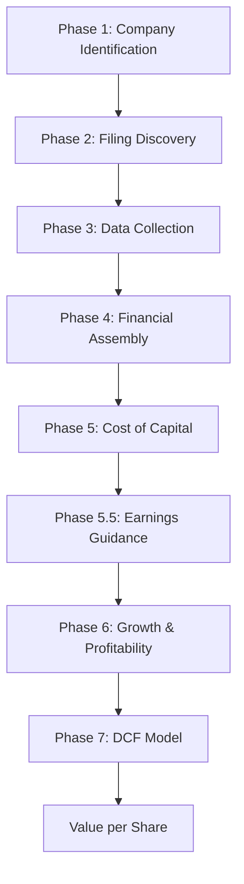

## How is it built?

The plugin is a bundle of 19 skills backed by a deterministic Python library of 12 modules:

- **Skills** handle the conversation — they know what to ask, when to fetch data, and how to present results. This includes fetching earnings call transcripts for management guidance, computing trailing financials, and generating case study write-ups.
- **Python library** (`lib/`) handles the math — WACC computation, DCF projection, convergence curve shapes, terminal value, equity bridge, option valuation, and failure rate estimation
- **Data pipeline** fetches live SEC EDGAR XBRL data, so valuations use real financial statements, not stale estimates

<Info>
  Every calculation is auditable. The plugin logs every input, intermediate value, and output to a run transcript so you can trace any number back to its source.
</Info>

## The pipeline

Valuation101 follows the same logical flow as Damodaran's fcffsimpleginzu spreadsheet, broken into 8 phases. Each phase is handled by one or more skills, and the output of each phase feeds into the next.

When running in Novice or Expert mode, Claude will ask for your inputs and in Lucky mode it blazes through all phases to produce an output.

---

## Phase 1: Company Identification

**Skill:** [company-identifier](/skills/company-identifier)

Resolves a company name or ticker to a confirmed identity — full legal name, ticker, CIK number, exchange, and sector. Uses SEC EDGAR search and web verification.

**Output:** Confirmed company identity with CIK for API calls.

---

## Phase 2: Filing Discovery

**Skill:** [identify-required-statements](/skills/identify-required-statements)

Determines which SEC filings are needed based on the company's fiscal calendar and the valuation date. Identifies the primary 10-K, prior-year 10-K, and any bridge 10-Q filings needed for LTM computation.

**Output:** `statements_required_{date}.json` — a structured list of every filing the pipeline needs.

---

## Phase 3: Data Collection

**Skills:** [pull-raw-data](/skills/pull-raw-data) → [parse-raw-data-to-filings](/skills/parse-raw-data-to-filings)

Downloads the company's full XBRL fact set from SEC EDGAR (a 5–15 MB JSON file containing every fact ever filed), then parses it into structured per-filing JSON files — one for each 10-K and 10-Q identified in Phase 2.

Intermediate outputs include a key inventory (`company-facts-keys.json`) and one CSV per XBRL tag for debugging.

**Output:** Per-filing `_raw.json` files with every valuation-relevant field extracted.

---

## Phase 4: Financial Assembly

**Skills:** [last-twelve-months](/skills/last-twelve-months) + [last-10-k](/skills/last-10-k)

Assembles the financial inputs Damodaran's spreadsheet needs:

- **LTM (Column B):** Trailing-twelve-month figures computed by combining the most recent 10-K with bridge quarter 10-Qs. For income statement items: `Annual + Current Quarter(s) − Prior Year Quarter(s)`. For balance sheet items: most recent quarter-end snapshot.
- **Last 10-K (Column C):** The most recent completed annual filing — used for year-over-year comparison and as the base for certain calculations.

**Output:** `ltm_{date}.json` and `last_10k_{date}.json` — mapped directly to Damodaran Input sheet cells B11–B23 and C11–C23.

---

## Phase 5: Cost of Capital

**Skill:** [cost-of-capital](/skills/cost-of-capital)

Computes the Weighted Average Cost of Capital (WACC) using three methods:

1. **Detailed** — bottom-up: unlevered beta → re-lever → CAPM cost of equity + synthetic rating → cost of debt → WACC
2. **Industry Average** — uses Damodaran's industry average cost of capital directly
3. **Distribution** — shows where the company falls on the sector-wide WACC distribution

Also handles operating lease and R&D adjustments if applicable ([lease-converter](/skills/lease-converter), [r-and-d-converter](/skills/r-and-d-converter)).

**Output:** WACC (%), cost of equity, cost of debt, and capital structure weights.

---

## Phase 5.5: Earnings Guidance

**Skill:** [earnings-guidance](/skills/earnings-guidance)

Fetches the most recent earnings call transcript and extracts management's forward-looking guidance on revenue and operating margins. When available, this guidance overrides LTM-derived defaults in the next phase — giving the model a more informed starting point, especially for companies undergoing rapid change.

The skill searches company IR pages, financial media, and SEC filings for transcripts, then uses structured LLM extraction to pull revenue (year 1 + long-term) and margin (year 1 + long-term) guidance with confidence ratings.

**Output:** `guidance-Q{N}-{YYYY}.json` with structured guidance values and raw management quotes.

<Info>
  This phase is optional. If no transcript is found or no usable guidance is extracted, the pipeline proceeds with LTM-derived defaults in Phase 6.
</Info>

---

## Phase 6: Growth & Profitability

**Skill:** [growth-and-profitability](/skills/growth-and-profitability)

Sets up the four forecast variables that drive the 10-year projection. For each variable, the skill determines a **start value** (year 1), an **end value** (year 10 target), and a **convergence curve** that controls the transition shape:

| Variable | Start value | End value | Curve controls |
|----------|-------------|-----------|----------------|
| Revenue growth | LTM growth or earnings guidance | Industry 5-year average | How quickly growth decelerates |
| Operating margin | LTM margin or earnings guidance | Industry average or guided target | How margins expand or compress |
| Sales-to-capital ratio | Company's current ratio | Industry average | How reinvestment efficiency evolves |
| Cost of capital | Initial WACC | Risk-free rate + ERP | How risk premium declines as company matures |

The [curve shapes library](/lib/curve-shapes) offers six convergence types (exponential decay, S-curve, linear, rapid deceleration, delayed deceleration, step-down) to model how real companies evolve. When [earnings guidance](/skills/earnings-guidance) is available from Phase 5.5, it overrides LTM-derived start and end values.

Industry benchmarks and distribution statistics are presented to help calibrate each assumption.

**Output:** Four 10-year schedules (one per variable) plus curve metadata, fed directly into the DCF engine.

---

## Phase 7: DCF Model

**Skill:** [fcff-model](/skills/fcff-model)

The core engine. Takes all prior outputs and runs:

1. **10-year FCFF projection** — year-by-year revenue, EBIT, after-tax operating income, reinvestment, and free cash flow
2. **Terminal value** — perpetuity growth model using a stable growth rate and terminal cost of capital
3. **Discounting** — present value of projected FCFFs + terminal value at WACC
4. **Equity bridge** — operating value → subtract debt → add cash → subtract employee options → divide by shares outstanding → **value per share**

Optional adjustments via [employee-options](/skills/employee-options) and [failure-rate](/skills/failure-rate).

**Output:** Estimated value per share, full projection table, and equity bridge breakdown.

---

## After the model

Three additional skills can run post-valuation:

- [**diagnostics**](/skills/diagnostics) — Damodaran's 6-step sanity check: is the growth reasonable? Do the margins converge? Is reinvestment consistent with growth?
- [**valuation-report**](/skills/valuation-report) — generates a formatted `.docx` report with all inputs, projections, and the equity bridge
- [**case-study-generator**](/skills/case-study-generator) — generates a Mintlify MDX case study page with data tables, convergence charts, and narrative commentary for the docs site

## Next steps

<CardGroup cols={2}>
  <Card title="Skills Reference" icon="book" href="/skills/overview">
    Detailed documentation for every skill
  </Card>
  <Card title="Data Handling" icon="database" href="/docs/data-pipeline">
    How SEC EDGAR data flows through the system
  </Card>
</CardGroup>
