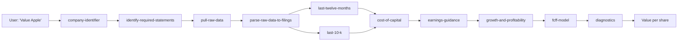

## What is Valuation101?

Valuation101 is a Claude plugin that performs Damodaran-style FCFF (Free Cash Flow to Firm) intrinsic valuations through conversation. You tell it which company to value, and it handles everything: fetching SEC filings, computing trailing-twelve-month financials, estimating the cost of capital, projecting cash flows, and arriving at an intrinsic value per share.

The plugin is built on [Aswath Damodaran's fcffsimpleginzu spreadsheet](https://pages.stern.nyu.edu/~adamodar/) — every formula maps to a specific cell in that workbook. The difference is that instead of manually populating a spreadsheet, you have a conversation.

## Who is it for?

- **Investors** who want a quick, rigorous DCF valuation of any US-listed company
- **Finance students** learning Damodaran's methodology who want an interactive walkthrough
- **AI agents** that need structured, machine-readable valuation data

## How is it built?

The plugin is a bundle of 19 skills backed by a deterministic Python library of 12 modules:

- **Skills** handle the conversation — they know what to ask, when to fetch data, and how to present results. This includes fetching earnings call transcripts for management guidance, computing trailing financials, and generating case study write-ups.
- **Python library** (`lib/`) handles the math — WACC computation, DCF projection, convergence curve shapes, terminal value, equity bridge, option valuation, and failure rate estimation
- **Data pipeline** fetches live SEC EDGAR XBRL data, so valuations use real financial statements, not stale estimates

<Info>
  Every calculation is auditable. The plugin logs every input, intermediate value, and output to a run transcript so you can trace any number back to its source.
</Info>

## Architecture at a glance

## Next steps

<CardGroup cols={2}>
  <Card title="Getting Started" icon="rocket" href="/docs/getting-started">
    Install and run your first valuation
  </Card>
  <Card title="How a Valuation is Performed" icon="gears" href="/docs/how-it-works">
    Deep dive into the 8-phase pipeline
  </Card>
</CardGroup>
