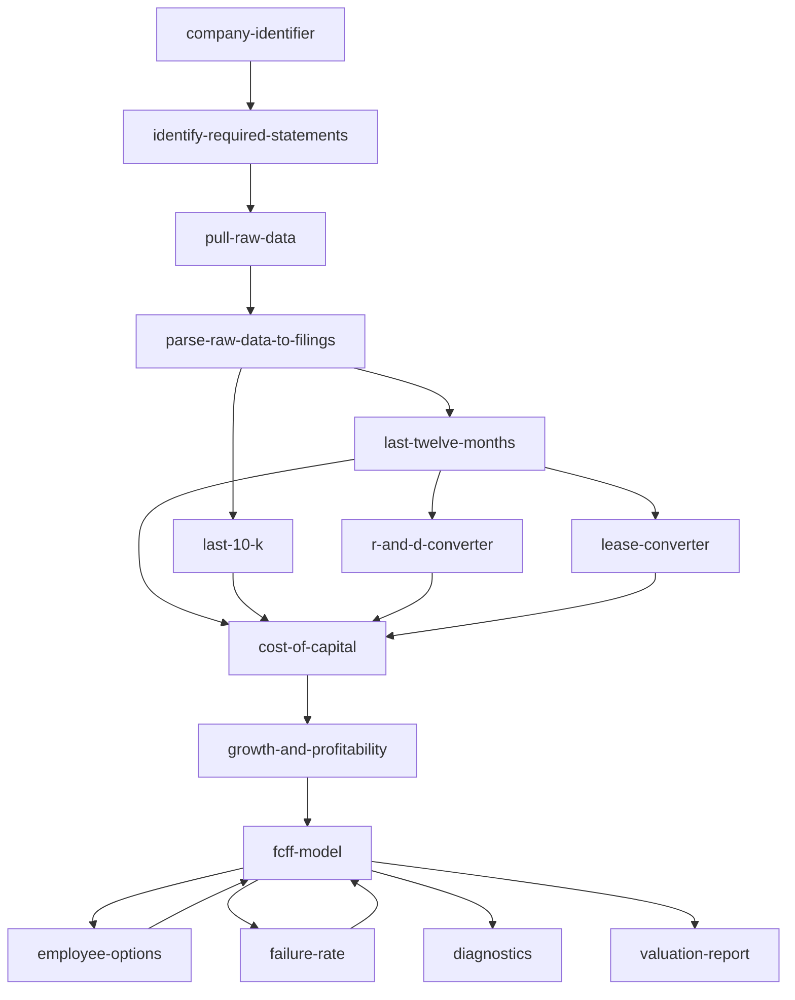

## The skill graph

Valuation101 is composed of 16 skills that execute in a defined order. Each skill has explicit inputs, outputs, and dependencies.



## Skill inventory

### Data Collection (Phase 1–3)

| Skill | Purpose | Inputs | Outputs |
|-------|---------|--------|---------|
| [company-identifier](/skills/company-identifier) | Resolve name/ticker to confirmed identity | Company name or ticker | CIK, ticker, legal name, sector |
| [identify-required-statements](/skills/identify-required-statements) | Determine which SEC filings are needed | Ticker, valuation date, fiscal calendar | `statements_required_{date}.json` |
| [pull-raw-data](/skills/pull-raw-data) | Download XBRL data from SEC EDGAR | CIK | `companyfacts.json` |
| [parse-raw-data-to-filings](/skills/parse-raw-data-to-filings) | Parse raw JSON into per-filing extracts | `companyfacts.json`, statements list | `_raw.json` per filing |
| [last-twelve-months](/skills/last-twelve-months) | Compute trailing-12-month financials | Per-filing `_raw.json` files | `ltm_{date}.json` |
| [last-10-k](/skills/last-10-k) | Extract most recent annual financials | Primary 10-K `_raw.json` | `last_10k_{date}.json` |

### Valuation Engine (Phase 4–5)

| Skill | Purpose | Inputs | Outputs |
|-------|---------|--------|---------|
| [cost-of-capital](/skills/cost-of-capital) | Compute WACC (3 methods) | LTM data, industry data, risk-free rate | WACC %, cost of equity, cost of debt |
| [growth-and-profitability](/skills/growth-and-profitability) | Set value-driver assumptions | LTM data, industry benchmarks | Growth rate, target margin, S/C ratio |
| [fcff-model](/skills/fcff-model) | Run the DCF engine | All prior outputs + assumptions | Value per share, projection table |

### Adjustments (Optional)

| Skill | Purpose | When used |
|-------|---------|-----------|
| [r-and-d-converter](/skills/r-and-d-converter) | Capitalize R&D into research asset | R&D > 5% of revenue |
| [lease-converter](/skills/lease-converter) | Convert operating leases to debt | Material operating leases |
| [employee-options](/skills/employee-options) | Value outstanding stock options | Company has employee options outstanding |
| [failure-rate](/skills/failure-rate) | Estimate probability of failure | All companies (adjusts final value) |

### Output (Phase 6)

| Skill | Purpose | Inputs | Outputs |
|-------|---------|--------|---------|
| [fcff](/skills/fcff) | Orchestrate the full pipeline | Company name + mode | End-to-end valuation |
| [diagnostics](/skills/diagnostics) | Sanity-check the valuation | Completed valuation output | 6-point diagnostic report |
| [valuation-report](/skills/valuation-report) | Generate formatted report | Completed valuation output | `.docx` report |

## For AI agents

Every skill page includes structured frontmatter with machine-parseable fields:

```yaml
skill_id: cost-of-capital
phase: 5
inputs: [LTM data, industry averages, risk-free rate]
outputs: [WACC (%), cost of equity, cost of debt, weights]
depends_on: [last-twelve-months, last-10-k]
feeds_into: [growth-and-profitability, fcff-model]
```

Access [`/llms.txt`](/llms.txt) for a curated index or [`/llms-full.txt`](/llms-full.txt) for the complete documentation in a single file.
